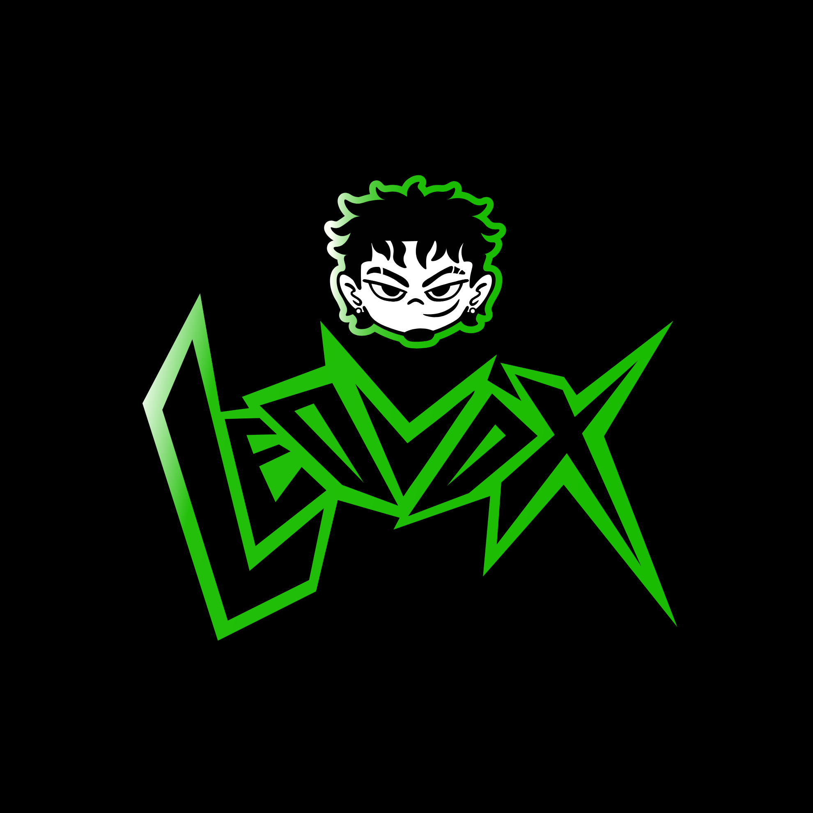

<p align="center">
  
</p>

# Olá — eu sou o Leonardo Gonçalves Sobral 👋

**Estudante de Ciência da Computação (CIn/UFPE) · Desenvolvedor Full‑Stack · Leovox Studios**

Sou um estudante do CIn com fome por código limpo, interfaces elegantes e projetos que contem histórias. Building things that *feel* polished and *work* reliably — esse é o meu combo favorito.

---

## Sobre / About me

* 🔭 Atualmente desenvolvendo meu portfólio e a identidade da **Leovox Studios**: [https://portfolio-digital-flask.onrender.com](https://portfolio-digital-flask.onrender.com)
* 🌱 Estudando: React, Python (Flask), estrutura de dados, Pygame e práticas de engenharia de software.
* 👨‍💻 Experiência prática: projetos acadêmicos (sCIna), gerenciamento de social media para *Saikai Sushi* e trabalhos de design gráfico freelance.
* 🎯 Objetivo: me tornar um desenvolvedor full‑stack com forte senso de design — shipping quality products, and learning fast.

---

## Skills & Ferramentas / Languages & Tools

Front‑end · Back‑end · Design — a mistura que eu gosto:

* **Languages:** Python, JavaScript, TypeScript, HTML, CSS.
* **Frameworks / Libraries:** React, Flask, Tailwind CSS.
* **Design & Prototyping:** Figma, Adobe (básico), identidade visual.
* **Dev tooling:** Git, GitHub, VS Code, Linux.
* **Interesses técnicos:** jogos com Pygame, acessibilidade web, boas práticas de UX, automação de deploy.

> Use estas badges abaixo no seu README substituindo `leozitogs` pelo seu usuário real.

```
[](https://github.com/leozitogs)
```

---

## Destaques / Selected Projects

(Pinned repos are great — pin these type of projects)

* **Portfolio — Leovox Studios** — Website pessoal com foco em identidade visual e apresentação de projetos. (React / Flask integration)
* **sCIna — Projeto Acadêmico** — storytelling & interface para sistema de comunicação acadêmica. Design + prototipagem + documentação.
* **Saikai Sushi — Social Media Toolkit** — templates gráficos, cronograma de postagens e automações para WhatsApp/Instagram.

> Cada projeto no repositório deve ter um `README.md` próprio com: resumo, tech stack, screenshots, como rodar localmente e licença.

---

## Como eu trabalho / Workflow

* Repositórios pequenos e focados: cada repo faz uma coisa e faz bem feita.
* Commits claros, PRs pequenos, issues descritas com contexto e screenshots.
* Documentação sempre: README, setup passo‑a‑passo e exemplos.

---

## Contato / Let's connect

* ✉️ Email: [studiosleovox@gmail.com](mailto:studiosleovox@gmail.com)
* LinkedIn: (em construção)
* Instagram: `https://www.instagram.com/leozitogs?igsh=Njg3dGp4YXU4dGg5`
* Portfolio: [https://portfolio-digital-flask.onrender.com](https://portfolio-digital-flask.onrender.com)

---

## GitHub Stats (coloque seu usuário)

<p align="center">
  
  
</p>

---
