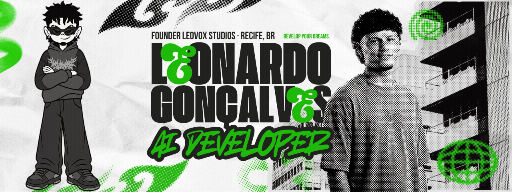
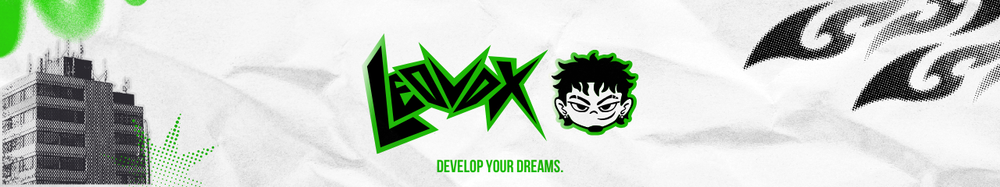

<!-- =================================================================
  README · leozitogs
  Leonardo Sobral · AI Developer · Founder, Leovox Studios
  Coloque este arquivo na raiz do repositorio leozitogs/leozitogs
  e o hero em assets/hero-animated.gif
================================================================= -->

<!-- ===================== 01 · HERO ===================== -->
<p align="center">
  
</p>

<!-- ===================== QUICK LINKS ===================== -->
<p align="center">
  <a href="https://www.linkedin.com/in/leonardo-gonçalves01/"></a>
  <a href="https://www.behance.net/leovoxstudiosS"></a>
  <a href="https://www.instagram.com/leozitogs"></a>
  <a href="mailto:studiosleovox@gmail.com"></a>
  <a href="https://portfolio-digital-flask.onrender.com"></a>
</p>

<br>

<!-- ===================== 02 · ABOUT ===================== -->
## 01 · About

I build at the intersection of artificial intelligence and design.

AI Developer at V-Lab (UFPE) and Computer Science student at CIn/UFPE. I work where engineering meets visual identity, shipping products that are technically solid and visually sharp. To me, code and design are not separate disciplines. They are one craft.

Right now I am focused on applied AI: LLM applications, agents, and turning models into tools people actually use. Beyond the code, I run **Leovox Studios**, my creative studio for design and software.

<br>

<!-- ===================== 03 · ARSENAL ===================== -->
## 02 · Arsenal

<!-- Substitua este bloco por assets/stack.svg quando o painel custom estiver pronto. -->

**AI / ML**  


**Frontend**  


**Backend**  


**Design**  


**Languages & Tooling**  


<br>

<!-- ===================== 04 · SELECTED WORK ===================== -->
## 03 · Selected Work

A few projects that show the range: applied AI, full-stack products, and systems work.

<table>
<tr>
<td width="50%">
<a href="https://github.com/leozitogs/vid2llm">

</a>
</td>
<td width="50%">
<a href="https://github.com/leozitogs/hi-ufpe-web">

</a>
</td>
</tr>
<tr>
<td width="50%">
<a href="https://github.com/leozitogs/leovox-task">

</a>
</td>
<td width="50%">
<a href="https://github.com/leozitogs/portfolio-digital-flask">

</a>
</td>
</tr>
</table>

**vid2llm** is published on PyPI:

```bash
pip install vid2llm
```
<!-- Confirme o nome exato do pacote no PyPI e a descricao de uma linha. -->

<br>

<!-- ===================== 05 · STATS ===================== -->
## 04 · Stats

<p align="center">


</p>

<br>

<!-- ===================== 06 · LEOVOX ===================== -->
## 05 · Leovox Studios

Leovox is my creative studio, operating where design meets software. Brand identity, web development, and product design under one roof. Same standard whether the deliverable is a model, an interface, or a brand.

**Develop your dreams.**

<!-- Opcional: adicione assets/footer-leovox.png aqui quando estiver pronto. -->

<p align="center">
<a href="https://portfolio-digital-flask.onrender.com">Portfolio</a>
&nbsp;·&nbsp;
<a href="https://www.behance.net/leovoxstudiosS">Behance</a>
</p>

<br>

<!-- ===================== FOOTER ===================== -->
<p align="center">

</p>
